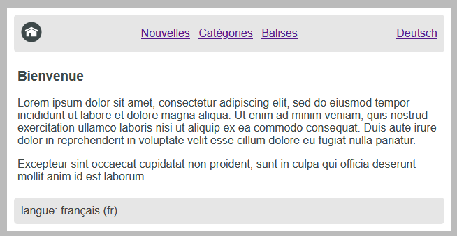
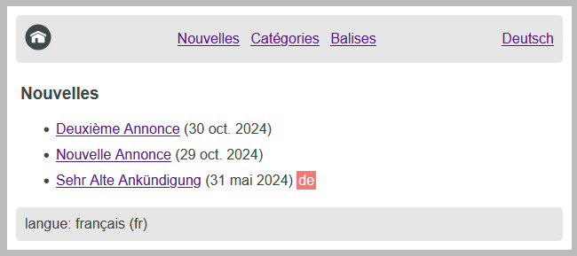

### Simple Hugo Website for Internationalization

_For more details see the walkthrough at [Hugo Website with Dual Language Support](https://northcoder.com/post/hugo-website-with-dual-language-sup/)._

A basic demo using [Hugo](https://gohugo.io/) - the static website generation framework.

In particular this is the simplest possible site I could build to take advantage of Hugo's [i18n](https://gohugo.io/content-management/multilingual/) support.

It doesn't use any third party themes.

The i18n requirements:

 - support 2 languages.
 - be able to toggle between these 2 languages for each specific resource/page.
 - if a translation is missing, indicate this to users.
 - showcase some of the built-in features for i18n provided by Hugo.
 - support two basic taxonomies ("category" and "tag").

A couple of screenshots:

_Home page:_

_Article listing:_

